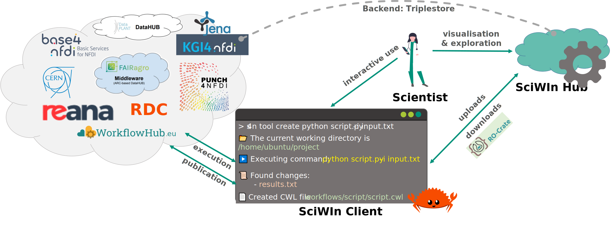

# Getting started
Computational workflows, which describe complex, multi-step procedures for automated execution, are essential for ensuring reproducibility, scalability, and efficiency in scientific research. The FAIRagro Scientific Workflow Infrastructure (SciWIn) supports scientists to create, execute, share, and publish these workflows, fostering collaboration and transparency.

## SciWIn Client
SciWIn Client (`s4n`) is designed to pick up scientists right at the in silico workbench, where iterative and highly interactive processes such as data extraction, cleaning, visualization, exploration, analysis and transformation are carried out. It is a command-line tool designed to easily create, record, annotate and execute computational workflows. What Git does for versioning, s4n does for provenance management. From simple one-step calculations to complex multi-branch pipelines, s4n records the chain of provenance for data and code artifacts. These records can be re-executed, also on remote computers. The individual artifacts and computational steps form a graph which can be annotated with semantic metadata. s4n also supports this annotation. s4n can package the resulting workflow as Workflow RO-Crate and publish it through WorkflowHub.

{ .bg-light-green }
/// caption
SciWIn Concept graphic describing the relations of SciWIn client to other SciWIn and non-SciWIn infrastructure components.
///

## Common Workflow Language
*Common Workflow Language* (CWL) is an open standard for the description of computational workflows. Tool wrappers are used for describing how to run certain commandline tools which can be connected to create workflows. 
CWL as being an open standard is portable and compatible with a variety of platforms including HPC and Kubernetes environments. CWL uses YAML to describe Tools and Workflows.
